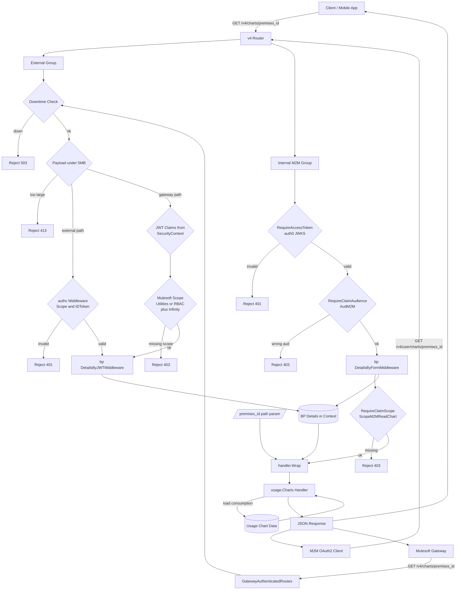

# Diagram

_Agent: `architect` (Software Architect)_  
_Status: `success` · attempts: 1_

---

```mermaid
flowchart TD
    Client[Client / Mobile App]
    M2M[M2M OAuth2 Client]
    Mulesoft[Mulesoft Gateway]

    Router[v4 Router]
    ExtGroup[External Group]
    IntGroup[Internal M2M Group]
    GwAuth[GatewayAuthenticatedRoutes]

    Downtime{Downtime Check}
    Payload{Payload under 5MB}
    AuthcMW{authc Middleware<br/>Scope and IDToken}
    JWTClaims{JWT Claims from<br/>SecurityContext}
    MuleScope{Mulesoft Scope<br/>Utilities or RBAC<br/>plus Infinity}
    AccessTok{RequireAccessToken<br/>auth0 JWKS}
    Audience{RequireClaimAudience<br/>AudM2M}
    ScopeChart{RequireClaimScope<br/>ScopeM2MReadChart}

    BPJwt[bp DetailsByJWTMiddleware]
    BPForm[bp DetailsByFormMiddleware]
    HandlerWrap[handler.Wrap]
    ChartsHandler[usage.Charts Handler]

    PremisesID[/premises_id path param/]
    BPCtx[(BP Details in Context)]
    ChartData[(Usage Chart Data)]
    Response[JSON Response]

    Client -->|GET /v4/charts/premises_id| Router
    M2M -->|GET /v4/user/charts/premises_id| Router
    Mulesoft -->|GET /v4/charts/premises_id| GwAuth

    Router --> ExtGroup
    Router --> IntGroup
    GwAuth --> Downtime

    ExtGroup --> Downtime
    Downtime -->|down| Reject1[Reject 503]
    Downtime -->|ok| Payload
    Payload -->|too large| Reject2[Reject 413]

    Payload -->|external path| AuthcMW
    AuthcMW -->|invalid| Reject3[Reject 401]
    AuthcMW -->|valid| BPJwt

    Payload -->|gateway path| JWTClaims
    JWTClaims --> MuleScope
    MuleScope -->|missing scope| Reject4[Reject 403]
    MuleScope -->|ok| BPJwt

    IntGroup --> AccessTok
    AccessTok -->|invalid| Reject5[Reject 401]
    AccessTok -->|valid| Audience
    Audience -->|wrong aud| Reject6[Reject 403]
    Audience -->|ok| BPForm
    BPForm --> ScopeChart
    ScopeChart -->|missing| Reject7[Reject 403]
    ScopeChart -->|ok| HandlerWrap

    BPJwt --> BPCtx
    BPForm --> BPCtx
    BPCtx --> HandlerWrap
    PremisesID --> HandlerWrap

    HandlerWrap --> ChartsHandler
    ChartsHandler -->|load consumption| ChartData
    ChartData --> ChartsHandler
    ChartsHandler --> Response
    Response --> Client
    Response --> M2M
    Response --> Mulesoft
```
